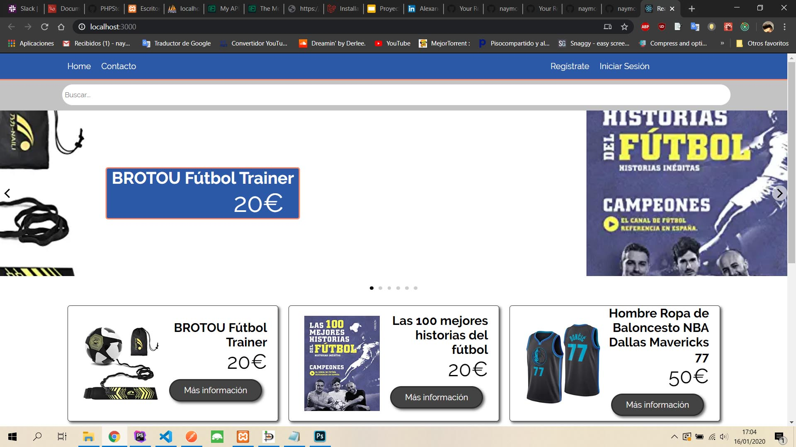
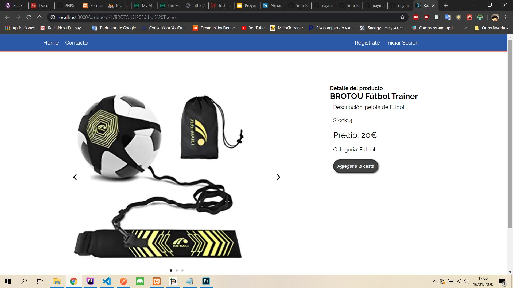
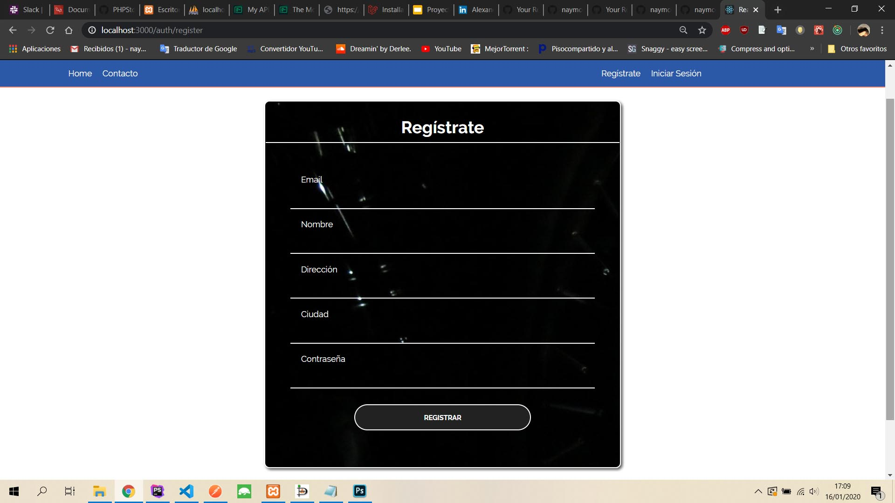
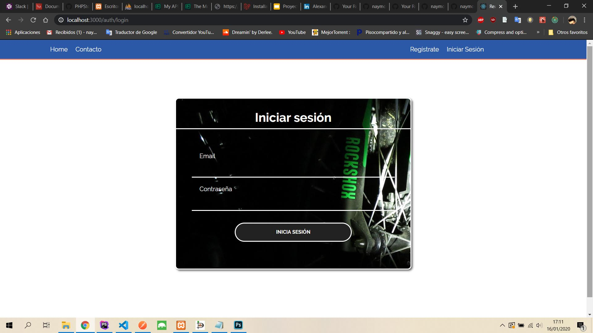
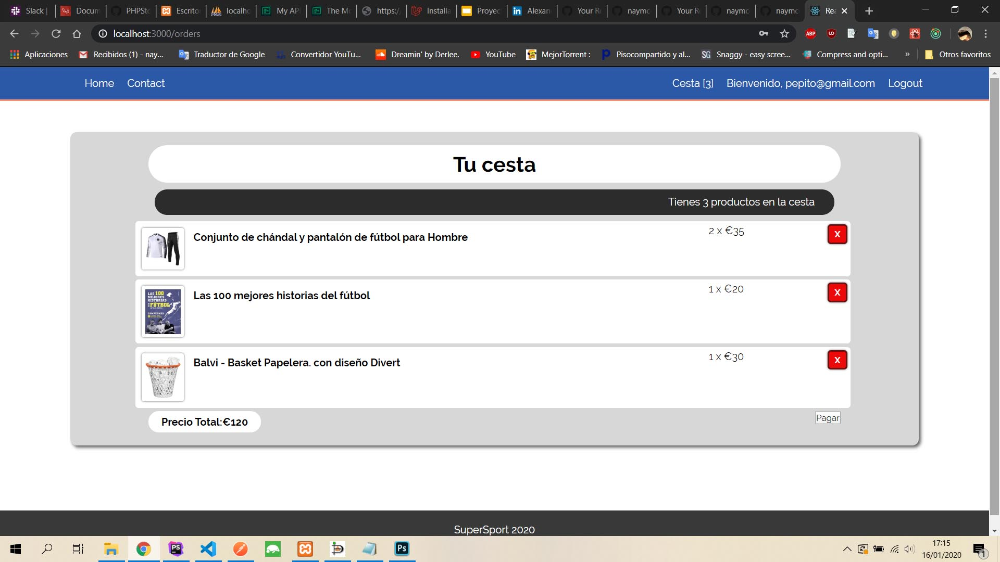

This project was bootstrapped with [Create React App](https://github.com/facebook/create-react-app).

## Frontend Ecommerce React

Proyecto para el bootcamp GeeksHubs Valencia

### Tecnologías usadas

Backend: en Nodejs y express
Base de datos: MySQL
Frontend: React

## Screenshots

Vista principal

Vista detalles del producto

Vista registro de usuario

Vista login de usuario

Vista cesta de productos llena

### npm install

Tanto para el proyecto de backend ( https://github.com/rubeneitor/BackendSQLSuperSport ), como en el frontend es necesario después de clonar el repositorio, instalar las dependencias necesarias para ponerlo en marcha.

npm install

### Ecommerce ( Aún en construcción )

Un proyecto bastante grande al que aún le faltan mcuhas cosas que iré agregando poco a poco. 

  ## Autores
  
  Backend Rubén Viosquez Beades
  ( https://github.com/rubeneitor )
  
  Frontend Alexander Santos Díaz
  ( https://github.com/naymco/ )
  

